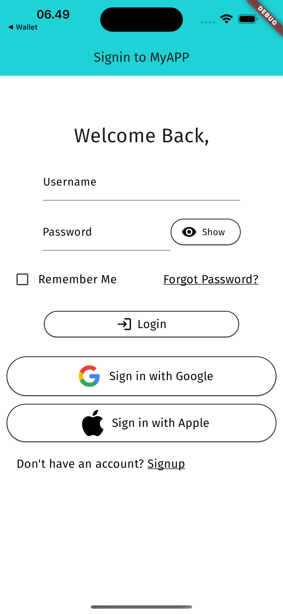

# Login Page Flutter

This is a simple login page created using Flutter, featuring signin with Google and Apple, forgot password functionality, and password visibility toggle.

## Screenshots

</img>

## Getting Started

1. Clone the repository:

```bash
git clone https://github.com/richoarbianto/flutter-login-page.git
```

2. Navigate to the project directory:

```bash
cd flutter-login-page
```

3. Install dependencies:

```bash
flutter pub get
```

4. Run the app:

```bash
flutter run
```

## Features

- Signin with Google
- Signin with Apple
- Forgot Password
- Password Visibility Toggle

## Dependencies

- [Sign in with Google](https://pub.dev/packages/google_sign_in) - for Google sign in functionality
- [Sign in with Apple](https://pub.dev/packages/sign_in_with_apple) - for Apple sign in functionality

Feel free to contribute or suggest improvements by opening an issue or pull request.

Happy coding!
